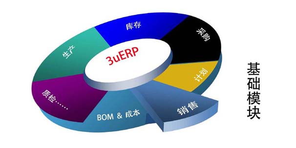
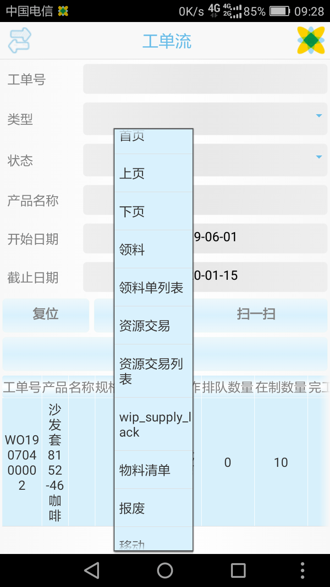

C/S、B/S双架构，完美运行于手机客户端、电脑客户端和主流浏览器 .

方便快速个性化定制与修改。

.

.

.

源代码在安装目录下（xbs文件夹，直接下载release的安装包，简单方便）.

截图及演示地址：http://xbs.3ucs.com

音视频演示(3UCS ERP安装部署) http://3ucs.com/video.php?vid=45

音视频演示(3UCS ERP基础功能) http://3ucs.com/video.php?vid=42

视频演示(3UCS ERP手机操作2017)http://3ucs.com/video.php?vid=43

视频演示(3UCS ERP二次开发培训视频2017)http://3ucs.com/video.php?vid=46

音视频演示(x+网页版安装部署) http://3ucs.com/video.php?vid=53

3UCS ERP操作手册: http://3ucs.com/plg/firm/firm.php?d.2.109 .

I. 依托3UCS x+平台实现了ERP的快速定制开发，其基础平台涵盖BOM、COST、SDSO、PO、AR、AP、FP、QA、WIP、PM、HR等诸多模块， 以BOM基础、成本管理为基石，提供完善的物料计划、生产计划、能力计划等强计划功能。由于3UCS x+平台的强大支撑， 3UCS ERP同时提供PC客户端、手机客户端、网页版本的支持以及多语言的支持， 并且其稳定性与功能的强大性也得到了极大的保障，而其定制能力的个性化及快速性都强大得应该无与伦比。

II. 3UCS ERP采用四级组织架构模式，每个级别的组织成员只能做相关的操作

1. 企业集团组织（Enterprise Org）

2.公司法人组织（Legal Org）

3.业务运营中心（Business Org）

4.库存组织（Inventory）

一个企业集团可以管辖多家法人公司，企业集团影响到雇员（employee）、位置（location）、组织（organization的建立）；

一个公司法人组织对应一套会计账簿（ledger），可以管辖多个业务运营中心；

运营中心的运作包括订单（Order Manage）、采购（Purchase）、应收（AR）应付（AP）、项目（Project）等，同时可以运作多个库存组织；

III. 3UCS ERP销售订单（生产发货）处理流程

库存组织有独立的库存移动及存货管理、库存开关张，负责订单的发货（Shipping）、采购的收货（Receiving）、库存管理、成本管理与控制、物料/工程（BOM/ENG）、生产（WIP）、计划（Planning）等；

销售订单的录入——>确认——>审批——>计划员确认发货计划（运行机会校验）并登记（BOOK，订单生产完毕会自动BOOK）——>采购——>生产入库——>（销售）发货通知——>仓库发货

IV. 安装

install/install.txt

Files & Dirs

0)xbs_??.xml
	user root layouts.
	
1).xpj
	bizxml project files, auto saved by biztool
	
2)'x'.xml, 'x'_GBDEDIT.xml, 'x'_GBDV.xml, 'x'_GBOPE.xml, 'x'_GBOPV.xml
	auto generated files use 'x'.xpj by biztool
	
3)v??.xml manual 
	composed files
	
4)??_V.xml(none of ??_Ve,??_Vh files exist)
	manual composed files
	
5)??_V.xml(view), ??_Ve.xml(Edit),??_Vh.xml(hide for edit),??_Vs.xml(search for view),??_Vv.xml(listctrl etc, for view)
	auto generated files(2 pages, one for view and one for edit)
	
6)??_V?m.xml,??_V?m.xml
	manual composed files(modified according to ??_V?.xml)
	
rule/		xlogic files invoked in "3)" files

lan/		language files

install/	install scripts and instructions

install/import_example.zip	Demo data(xyz9g.xls,bom_resource.xls,customer.xls,poQuote.xls,sdQuote.xls) and examples for import 

install/orderNoYearMon.sql	sql for OrderNo only with Year and Month

install/costUpgrade	sql for cost upgrade

V. Dev

发货单数量与对应的分捡出库单数量须一致，否则不应完成分捡出库

发货完成后 “取消发货”（影响发货数量及分捡数量） 后应该手动取消出库单完成退货入库。

Discuss（在线客服）

Contact us at  if you have feedback, questions or want to chat. 
